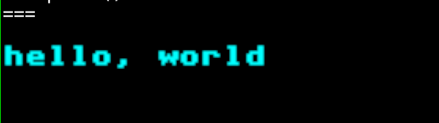
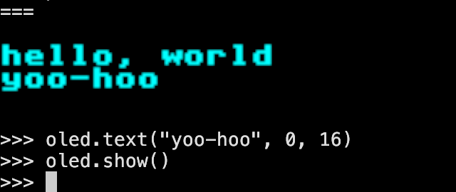

# termbuf

MicroPython library for displaying OLED graphics in the terminal using the Kitty Graphics Protocol.

The library provides the same interface as eg the [`ssd1306` micropython driver](https://github.com/stlehmann/micropython-ssd1306), meaning the same code can be used in both to output to the terminal or to a real OLED display.

## Getting Started


Start a MicroPython REPL. If you have a MicroPython device connected this is done by calling `mpremote`. You can also start MicroPython in a container:

```bash
docker run --rm -it micropython/unix
```

Then, install `termbuf`:

```python
import mip
mip.install("github:nmattia/termbuf")
```

You can then display OLED data in your terminal (you can use `Ctrl+E` to enter MicroPython "paste mode"):

```python
import termbuf

# mimick a 0.91" 128x32 monochrome OLED
oled = termbuf.TermBuffer(128, 32)

oled.fill(0)
oled.text("hello, world", 0, 8)
oled.show()
print() # move the cursor down if necessary
```



> [!NOTE]
>
> The `termbuf` library makes use of the [Terminal Graphics Protocol](https://sw.kovidgoyal.net/kitty/graphics-protocol/) implemented by terminals like [kitty](https://github.com/kovidgoyal/kitty) and [ghostty](https://ghostty.org). If you do not see an image, your terminal might not support the Terminal Graphics Protocol.

The full [`framebuf`](https://docs.micropython.org/en/latest/library/framebuf.html) API is available. You can edit the contents at will and update the display by calling `show()`:


```python
oled.text("yoo-hoo", 0, 16)
oled.show()
```


